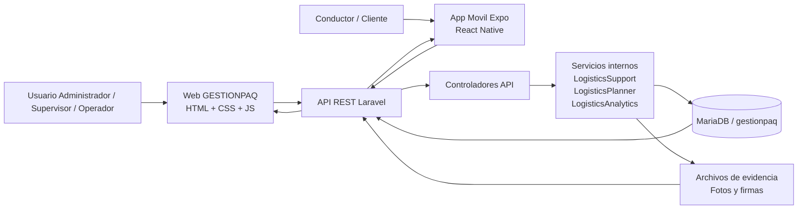

# Presentacion Sugerida - GESTIONPAQ

Esta guia esta pensada para convertir el proyecto actual en una presentacion de 10 a 15 minutos, concreta, visual y alineada con lo que les pidieron.

## 1. Estructura recomendada

Usen entre 14 y 16 diapositivas. Con este orden quedan dentro del tiempo:

1. Portada
2. Introduccion
3. Problema a resolver
4. Objetivo general
5. Descripcion general de la solucion
6. Como funciona la propuesta
7. Alcance del sistema
8. Modulos o servicios incluidos
9. Arquitectura del proyecto
10. Analisis del sistema: 5 requerimientos funcionales
11. Modulo 1: Gestion de envios
12. Modulo 2: Gestion de rutas y asignaciones
13. Modulo 3: Rastreo y evidencia de entrega
14. Dashboard con graficas dinamicas
15. Exportacion de reportes en PDF
16. Demo, problemas encontrados, lecciones, mejoras y conclusion final

## 2. Guion listo para usar por diapositiva

## Diapositiva 1. Portada

Texto sugerido:

- Nombre del proyecto: GESTIONPAQ
- Subtitulo: Plataforma web y movil para gestion logistica de envios, rutas y evidencias
- Materia
- Nombre del docente
- Integrantes del equipo
- Fecha

Que decir:

"Nuestro proyecto se llama GESTIONPAQ. Es una plataforma orientada a la gestion logistica de paquetes, rutas, conductores, evidencias de entrega y reportes. La solucion integra una interfaz web, una app movil, una API REST y una base de datos central."

Visual recomendado:

- Logo o nombre grande del proyecto
- Una captura del dashboard
- Una captura de la app movil

## Diapositiva 2. Introduccion

Texto sugerido:

"Actualmente, en muchos procesos logisticos, la informacion de envios, rutas y entregas se encuentra dispersa, lo que provoca retrasos, poca trazabilidad y dificultad para tomar decisiones. GESTIONPAQ centraliza la operacion y permite administrar el flujo logistico desde la planeacion hasta la entrega final."

Que decir:

"La idea principal del proyecto fue concentrar toda la operacion en un solo sistema. En lugar de trabajar con registros separados o seguimiento manual, nuestra propuesta ofrece control de envios, seguimiento por codigo, panel con indicadores, captura de evidencia y reportes descargables."

## Diapositiva 3. Problema a resolver

Texto sugerido:

- Falta de control centralizado de envios
- Dificultad para asignar rutas, conductores y vehiculos
- Baja trazabilidad del paquete durante el recorrido
- Poca visibilidad para clientes y personal operativo
- Reportes manuales y lentos

Que decir:

"El problema que buscamos resolver fue la falta de visibilidad y control en la operacion logistica. Sin un sistema integrado, es dificil saber que paquete esta pendiente, cual esta en ruta, quien lo transporta, donde se encuentra y si ya se entrego con evidencia."

## Diapositiva 4. Objetivo general

Texto sugerido:

"Desarrollar un sistema logistico integral que permita gestionar envios, rutas, unidades, conductores, rastreo, evidencias de entrega y reportes operativos, mediante una plataforma web y movil conectada a una API y base de datos central."

Que decir:

"Nuestro objetivo general fue construir una solucion completa que no solo almacene informacion, sino que tambien apoye la operacion diaria, la toma de decisiones y la trazabilidad del servicio."

## Diapositiva 5. Descripcion general de la solucion

Texto sugerido:

- Plataforma web para administracion y supervision
- Aplicacion movil para operacion en campo
- API REST para conectar todos los modulos
- Base de datos para almacenar catalogos y operaciones
- Dashboard con indicadores y graficas
- Exportacion de reportes en PDF y CSV

Que decir:

"La solucion esta formada por cuatro piezas principales. Primero, la plataforma web, donde se gestiona la operacion administrativa. Segundo, la app movil, orientada al trabajo en campo. Tercero, la API REST, que procesa reglas de negocio y conecta clientes con la base de datos. Cuarto, la base de datos, donde se guarda toda la informacion del sistema."

## Diapositiva 6. Explicacion breve de como funciona la propuesta

Texto sugerido:

1. El usuario inicia sesion.
2. La interfaz web o movil consume la API.
3. La API valida datos, roles y reglas de negocio.
4. La base de datos guarda o consulta la informacion.
5. El sistema devuelve resultados a la interfaz.
6. El dashboard y los reportes muestran el estado de la operacion.

Guion sugerido:

"Cuando un usuario entra al sistema, ya sea desde web o movil, primero se autentica. Despues, cada accion que realiza viaja por la API. La API valida permisos, procesa la logica del negocio y consulta la base de datos. Finalmente, la respuesta vuelve a la interfaz para mostrar envios, rutas, rastreo, evidencias o reportes."

## Diapositiva 7. Alcance del sistema

Texto sugerido:

- Inicio de sesion con roles
- Consulta de dashboard operativo
- Gestion de clientes, envios, rutas, conductores y vehiculos
- Rastreo por codigo
- Registro de evidencias de entrega
- Reportes exportables
- App movil conectada a la misma API

Que decir:

"El alcance actual del sistema cubre tanto la parte administrativa como la operativa. Incluye autenticacion, consulta de indicadores, gestion de envios y rutas, rastreo, evidencia de entrega, reportes y uso movil para el personal de campo."

## Diapositiva 8. Que modulos o servicios incluye

Texto sugerido:

- Autenticacion y control por roles
- Dashboard
- Operaciones y clientes
- Envios
- Rutas
- Conductores
- Vehiculos
- Mantenimiento
- Usuarios y configuracion
- Rastreo
- Evidencias
- Reportes
- App movil

Que decir:

"El sistema esta dividido en modulos. Esto nos permitio separar responsabilidades y hacer mas clara la arquitectura. Cada modulo tiene su propia interfaz, endpoints y relacion con tablas especificas de base de datos."

## Diapositiva 9. Arquitectura del proyecto

Texto sugerido:

"La arquitectura integra una capa web, una capa movil, una API REST en Laravel, clases de soporte para reglas de negocio y una base de datos MariaDB. Ademas, las evidencias de entrega se almacenan como archivos y se relacionan con los registros del sistema."

Diagrama sugerido:

Explicacion corta del diagrama:

"La web y la app movil consumen la misma API. La API recibe solicitudes, ejecuta reglas de negocio, consulta la base de datos y devuelve respuestas en formato JSON. Cuando se registra evidencia, tambien guarda archivos como fotos y firmas."

## Diapositiva 10. Analisis del sistema: 5 requerimientos funcionales

Texto sugerido:

1. El sistema debe permitir iniciar sesion con correo o usuario y generar un token de acceso.
2. El sistema debe permitir registrar, consultar, editar y eliminar envios.
3. El sistema debe permitir gestionar rutas, vehiculos y conductores para la operacion.
4. El sistema debe permitir rastrear un envio por codigo y mostrar su historial.
5. El sistema debe permitir registrar evidencia de entrega y exportar reportes en PDF.

Que decir:

"Estos requerimientos funcionales se encuentran reflejados en la API y en la interfaz. No son solo pantallas visuales, sino funciones conectadas con reglas y datos reales."

## Diapositiva 11. Funcionalidad implementada: Modulo 1 - Gestion de envios

Texto sugerido:

- Interfaz:
  envios.html y envio-form.html en web
  ShipmentsScreen en la app movil
- Endpoints:
  GET /api/shipments
  GET /api/shipments/{id}
  POST /api/shipments
  PUT /api/shipments/{id}
  DELETE /api/shipments/{id}
- API:
  valida datos del envio, genera tracking y prepara contexto logistico
- Base de datos:
  tablas paquetes, clientes, estado_paquete, almacenes

Guion sugerido:

"El modulo de envios permite registrar paquetes con remitente, destinatario, peso, volumen, direccion, prioridad y fecha programada. La API procesa esos datos y puede dejar el envio como pendiente, planificado o asignado segun la logica operativa."

Punto fuerte para explicar:

"Aqui no solo guardamos un registro. Tambien se prepara el contexto logistico del envio, por ejemplo el origen, el destino y la posibilidad de recomendar una ruta."

## Diapositiva 12. Funcionalidad implementada: Modulo 2 - Gestion de rutas y asignaciones

Texto sugerido:

- Interfaz:
  rutas.html y ruta-form.html
  RoutesScreen en movil
- Endpoints:
  GET /api/routes
  GET /api/routes/{id}
  POST /api/routes
  PUT /api/routes/{id}
  DELETE /api/routes/{id}
- API:
  sincroniza conductor, vehiculo, asignaciones y metricas de ruta
- Base de datos:
  tablas rutas, ruta_paradas, asignaciones, vehiculos, conductores

Guion sugerido:

"El modulo de rutas organiza la salida operativa. Permite definir almacen, distancia, tiempo estimado, estado, conductor y vehiculo. Ademas, cuando se actualiza una ruta, la API sincroniza la informacion operacional y recalcula metricas como carga y optimizacion."

Punto fuerte para explicar:

"La ruta no esta aislada. Esta conectada con los paquetes asignados, el conductor, el vehiculo y el avance operativo."

## Diapositiva 13. Funcionalidad implementada: Modulo 3 - Rastreo y evidencia de entrega

Texto sugerido:

- Interfaz:
  rastreo.html y evidencias.html
  TrackingScreen y EvidenceScreen en movil
- Endpoints:
  GET /api/tracking/{trackingCode}
  GET /api/evidences
  POST /api/shipments/{id}/evidence
- API:
  consulta historial del paquete, guarda evidencia, actualiza estado y registra tracking
- Base de datos:
  tablas tracking, evidencias, paquetes, asignaciones, configuracion_sistema

Guion sugerido:

"Este modulo permite seguir un envio por codigo y ver su historial. Ademas, desde la operacion movil se puede registrar evidencia de entrega, incluyendo nombre del receptor, foto, firma, ubicacion GPS y notas. Cuando se guarda la evidencia, el sistema actualiza el paquete y registra el evento correspondiente."

Punto fuerte para explicar:

"Este modulo conecta la calle con el sistema. Lo que hace el conductor en movil impacta inmediatamente en la trazabilidad del paquete y en el panel web."

## Diapositiva 14. Modulo de dashboard con graficas dinamicas

Texto sugerido:

- Consulta principal:
  GET /api/dashboard?range=today o week
- Graficas:
  evolucion operativa
  estado de paquetes
  entregas por hora
  estado de rutas
- Indicadores:
  paquetes totales
  rutas
  vehiculos
  conductores
  SLA
  capacidad usada

Guion sugerido:

"El dashboard es uno de los modulos mas importantes porque transforma los datos operativos en informacion visual. Las graficas cambian dinamicamente segun el rango seleccionado y el rol del usuario. Por ejemplo, se muestran tendencias de movimientos, distribucion de estados, entregas por horario y estado actual de las rutas."

Punto fuerte para explicar:

"No son graficas estaticas. Se alimentan desde la API y se recalculan con base en envios, rutas, vehiculos, conductores y eventos de tracking."

## Diapositiva 15. Exportacion en PDF

Texto sugerido:

- Consulta de reportes:
  GET /api/reports
- Exportacion:
  GET /api/reports/export/csv
  GET /api/reports/export/pdf
- Acceso por roles:
  admin y supervisor
- Salida:
  reporte con tarjetas de indicadores y tabla resumida

Guion sugerido:

"El sistema tambien incluye un modulo de reportes. Desde la interfaz se selecciona el rango y se descargan archivos en PDF o CSV. La API construye un resumen del periodo y genera el documento para compartirlo o respaldar decisiones."

Punto fuerte para explicar:

"Esta funcionalidad es importante porque convierte la informacion operativa en un entregable formal para supervision y seguimiento."

## Diapositiva 16. Demo del proyecto

Texto sugerido:

Demo sugerida en vivo o en video:

1. Iniciar sesion como administrador en la web.
2. Mostrar dashboard y cambiar el rango.
3. Entrar a envios y mostrar lista o alta de un envio.
4. Mostrar rutas o una asignacion relacionada.
5. Abrir rastreo y consultar un codigo.
6. Desde la app movil, iniciar sesion como conductor.
7. Mostrar rutas o tracking.
8. Registrar una evidencia de entrega.
9. Volver a web y mostrar el cambio en tracking o reportes.
10. Descargar un PDF.

Guion sugerido:

"En la demo mostraremos primero la parte administrativa en web y despues la parte operativa en movil. La idea es evidenciar que ambos clientes consumen la misma API y trabajan sobre la misma informacion."

## 3. Guion del video sin voz de minimo 5 minutos

Pueden grabarlo asi:

1. 0:00 a 0:30 - Portada o login web.
2. 0:30 a 1:20 - Dashboard y cambio de rango.
3. 1:20 a 2:10 - Modulo de envios.
4. 2:10 a 2:50 - Modulo de rutas.
5. 2:50 a 3:30 - Modulo de rastreo.
6. 3:30 a 4:20 - App movil: login y pantalla principal.
7. 4:20 a 4:50 - Registro de evidencia.
8. 4:50 a 5:20 - Volver a web y exportar PDF.

Consejo:

- Graben sin voz, pero pongan titulos cortos en pantalla como "Login", "Dashboard", "Nuevo envio", "Tracking", "Evidencia", "Reporte PDF".

## 4. Problemas encontrados y solucion

Estos puntos si estan sustentados por el proyecto y se pueden exponer como problemas reales del desarrollo:

1. Inconsistencias del esquema de base de datos.
Solucion: se implemento una capa de traduccion y compatibilidad para mapear nombres heredados en espanol e ingles, por ejemplo tracking_code y codigo_tracking, o vehicle_id y vehiculo_id.

2. Necesidad de compartir la misma logica entre web y movil.
Solucion: se centralizo la logica en la API REST y ambos clientes consumen los mismos endpoints.

3. Manejo de permisos por rol.
Solucion: se controlo acceso y visibilidad para admin, supervisor, operador, despachador, conductor y cliente.

4. Registro de evidencia con foto y firma.
Solucion: la API valida configuracion, almacena archivos y actualiza el estado del paquete junto con el tracking.

5. Conectividad de la app movil con la API local.
Solucion: la app movil prueba distintas bases API y recuerda la ultima que funciono, evitando errores por cambio de red o IP local.

## 5. Lecciones aprendidas

Pueden decir estas 5:

1. Separar frontend, API y base de datos facilita el mantenimiento.
2. Definir roles desde el inicio mejora la seguridad y la experiencia de usuario.
3. Un endpoint bien disenado sirve tanto para web como para movil.
4. Las evidencias de entrega fortalecen la trazabilidad del sistema.
5. Los dashboards ayudan a convertir datos en decisiones.

## 6. Lecciones no aprendidas o areas donde fallamos

Aqui conviene ser honestos y mostrar madurez tecnica:

1. Debimos normalizar antes los nombres de columnas de la base de datos.
2. Debimos documentar todos los contratos de la API desde la primera etapa.
3. Debimos planear pruebas automatizadas desde el inicio y no al final.
4. Debimos preparar desde antes los datos de demo para la exposicion.
5. Debimos cerrar antes algunos detalles de integracion entre entorno local y app movil.

## 7. Mejoras a implementar

Texto sugerido:

- Integrar mapas en tiempo real para seguimiento geografico
- Agregar notificaciones automticas de cambios de estado
- Implementar historial avanzado y filtros mas completos
- Mejorar la planeacion automatica de rutas con geolocalizacion real
- Generar reportes mas detallados por cliente, conductor o periodo
- Incluir indicadores predictivos para demanda y carga operativa

## 8. Conclusion final

Texto sugerido:

"Como conclusion, GESTIONPAQ es una solucion integral que conecta la administracion, la operacion y el seguimiento logistico en una sola plataforma. El proyecto logra integrar interfaz web, app movil, API y base de datos para resolver un problema real de control, trazabilidad y analisis operativo."

Guion sugerido:

"Nuestro proyecto no solo organiza informacion, sino que conecta procesos clave del flujo logistico. La principal aportacion fue integrar diferentes capas tecnicas para ofrecer una solucion funcional, escalable y orientada a la toma de decisiones."

## 9. Reparto sugerido por integrantes

Si son 4 integrantes:

- Integrante 1: Portada, introduccion, problema y objetivo general
- Integrante 2: Solucion, alcance, modulos y arquitectura
- Integrante 3: Requerimientos funcionales, modulo de envios y modulo de rutas
- Integrante 4: Rastreo, dashboard, PDF, demo, problemas, lecciones y conclusion

Si son 5 integrantes:

- Integrante 1: Portada e introduccion
- Integrante 2: Problema, objetivo y descripcion general
- Integrante 3: Alcance, modulos y arquitectura
- Integrante 4: Requerimientos funcionales y modulos principales
- Integrante 5: Dashboard, PDF, demo, problemas, lecciones, mejoras y conclusion

## 10. Preguntas que probablemente les hagan

1. Que tecnologia usaron?
Respuesta sugerida: "Usamos Laravel para backend y API, MariaDB como base de datos, HTML, CSS y JavaScript para la interfaz web, y React Native con Expo para la app movil."

2. Como se comunican la web y la app movil?
Respuesta sugerida: "Ambas consumen la misma API REST, por eso comparten la misma logica y la misma informacion."

3. Como controlan la seguridad?
Respuesta sugerida: "Con autenticacion por token y control de acceso por roles."

4. Donde se ve el dashboard dinamico?
Respuesta sugerida: "En el modulo principal del sistema, donde se calculan indicadores y graficas segun el rango y el rol."

5. Como generan el PDF?
Respuesta sugerida: "Desde la API, que arma el reporte y lo descarga como archivo PDF."

## 11. Datos tecnicos del proyecto que pueden mencionar con seguridad

- Backend: Laravel con controladores API
- Web: archivos estaticos en public/logistichub
- Movil: Expo React Native
- API: autenticacion, dashboard, envios, rutas, usuarios, reportes, tracking y evidencias
- Base de datos: MariaDB gestionpaq
- Reportes: CSV y PDF
- Roles identificados en el sistema: admin, operator, supervisor, dispatcher, driver, customer
- Evidencias: foto, firma, receptor, GPS y notas

## 12. Archivos del proyecto que respaldan la exposicion

- routes/api.php
- public/logistichub/assets/js/pages/dashboard.js
- public/logistichub/assets/js/pages/reports.js
- app/Http/Controllers/Api/ShipmentController.php
- app/Http/Controllers/Api/RouteController.php
- app/Http/Controllers/Api/TrackingController.php
- app/Http/Controllers/Api/EvidenceController.php
- app/Http/Controllers/Api/ReportController.php
- app/Support/LogisticsPlanner.php
- app/Support/LogisticsAnalytics.php
- mobile-expo/App.js
- mobile-expo/src/api.js
- database/sql/gestionpaq_actual.sql

## 13. Recomendacion final para PowerPoint o Canva

Para que se vea profesional y no saturado:

- Una idea principal por diapositiva
- No meter parrafos largos en pantalla
- Usar capturas reales del sistema
- Usar el diagrama de arquitectura en una sola diapositiva
- Resaltar en color los endpoints mas importantes
- En la demo, mostrar flujo real de web a movil y de movil a web

Si quieren que la exposicion salga mas fuerte, enfaticen siempre esta idea:

"El valor del proyecto no es solo la interfaz, sino la integracion completa entre web, movil, API, base de datos, dashboard, evidencia y reportes."
